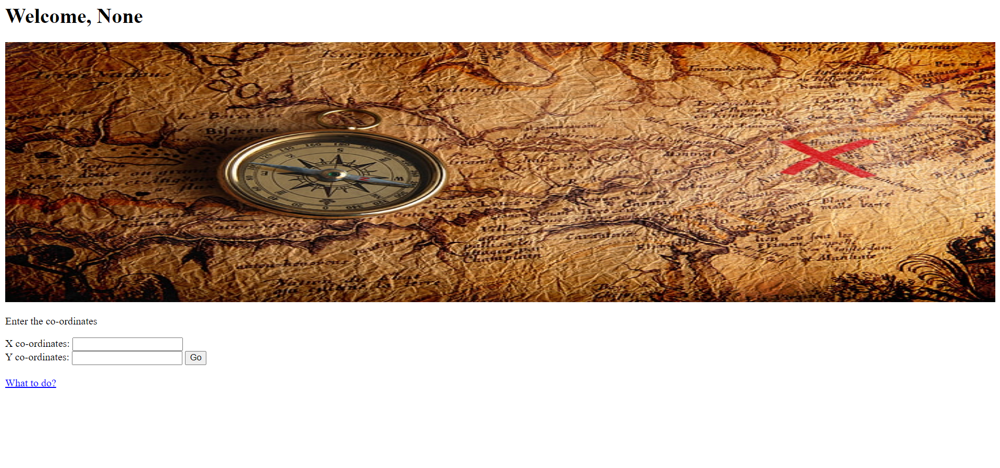
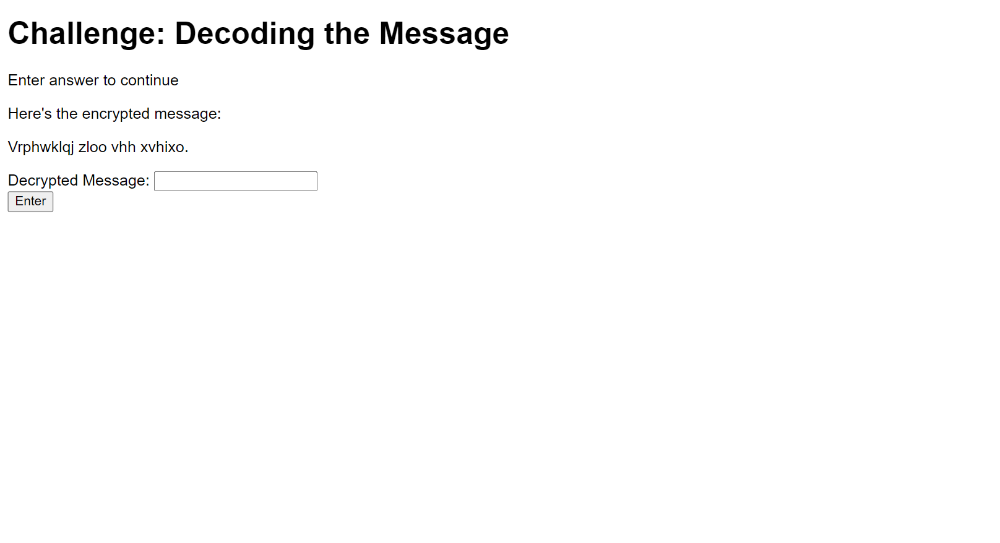
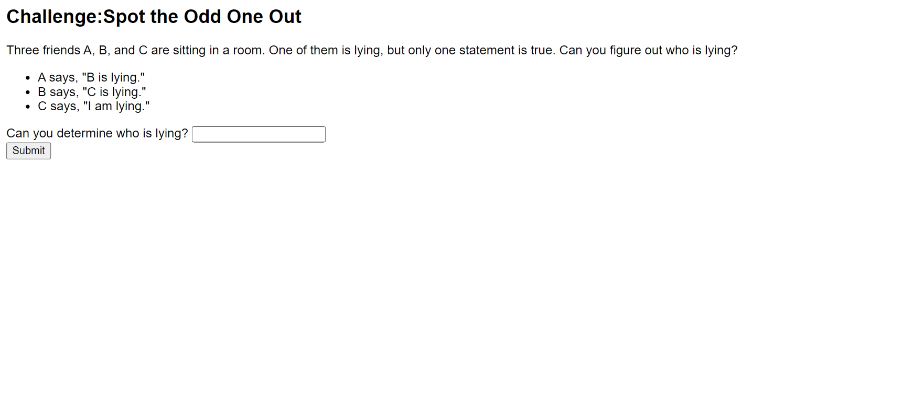
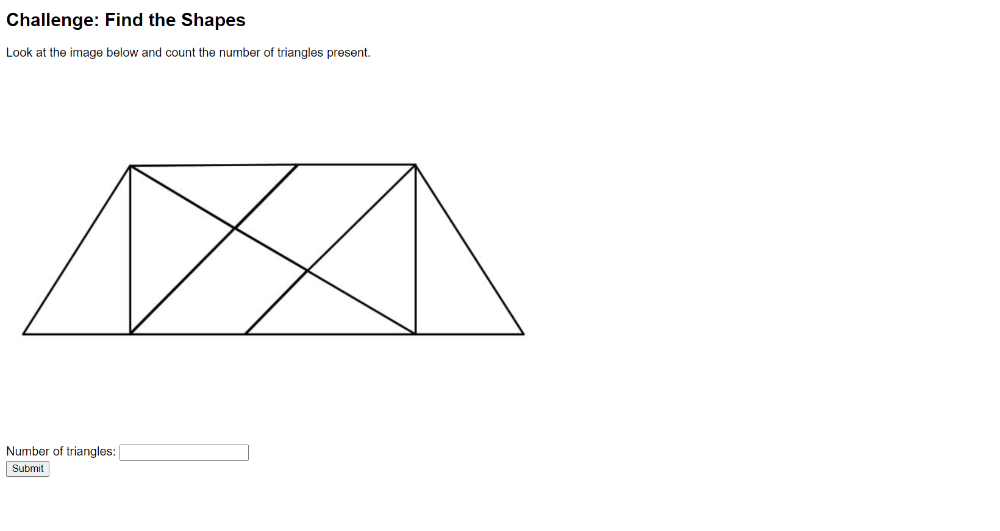
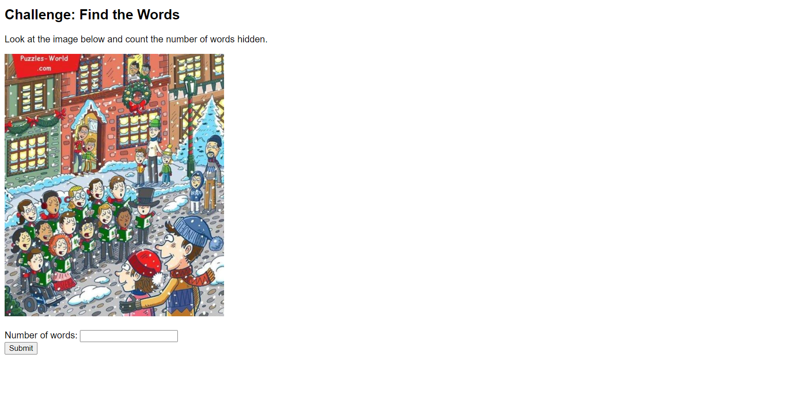
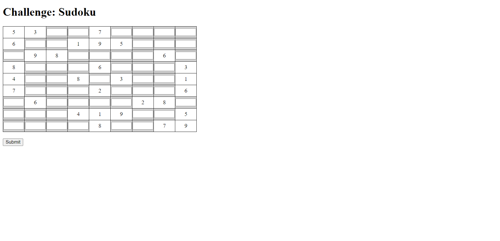

# Treasure Hunt Game - Web Development Project

## Overview

The Treasure Hunt Game is a web-based project I developed to showcase my web development skills. It's a simple yet engaging game where players solve puzzles and challenges to uncover hidden treasures. This project demonstrates my ability to create interactive web applications using Flask and HTML.

)

## Features

- A series of challenges and puzzles for players to solve.
- User registration and login functionality.
- MySQL database integration for storing user data and game statistics.
- Responsive web design for seamless gameplay on various devices.

## Project Structure

- **app/**
  - **static/**
    - **images/**: Placeholder images used in the game challenges.
  - **templates/**: HTML templates for different game pages.
  - **main.py**: The main Flask application file.

## Setup and Usage

1. Clone this repository to your local machine:

   ```bash
   git clone https://github.com/your-username/treasure-hunt-game.git
   ```

2. Create a virtual environment and activate it:

   ```bash
   python -m venv venv
   source venv/bin/activate
   ```

3. Install the required Python packages:

   ```bash
   pip install -r requirements.txt
   ```

4. Set up your MySQL database and update the database configuration in `main.py`.

5. Run the Flask application:

   ```bash
   python main.py
   ```

6. Open your web browser and go to `http://localhost:5000/` to explore and play the game.

## Showcase Your Skills

Feel free to explore the code, customize the game challenges, or add your own features. This project serves as an excellent addition to my web development portfolio, demonstrating my abilities in front-end and back-end development.

**Screenshots:**

- Staring Page
  

- Challenge 1
  

- Challenge 2
  

- Challenge 3
  

- Challenge 4
  

- Challenge 5
  

Enjoy the Treasure Hunt Game and have fun exploring!
